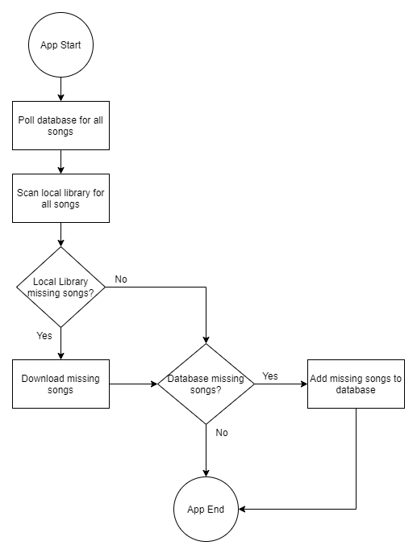

# Beat Library Sync

> [!WARNING]
> This project was abandoned before it could be completed.

Shared repository of beat saber songs. Application runs locally on the system, polls an external database for a list of song keys, then downloads the songs to the local hard drive. It then scans local hard drive and adds the missing song keys to the database.

# Flow Diagram

